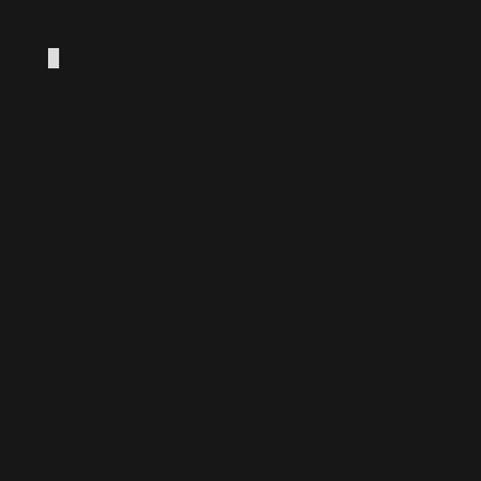

# lean-brotli 🥦

   

Lean 4 bindings for [Brotli](https://github.com/google/brotli) compression (RFC 7932).

Provides whole-buffer and streaming APIs for Brotli compression and decompression, plus file-level helpers.

<i>"**To Brotli, or not to Brotli**, that is the compression. <br>
Whether ’tis nobler in the RAM to suffer<br>
The slings and arrows of outrageous file sizes,<br>
Or to take arms against a sea of plaintext<br>
And by deflating end them."</i>



## Requirements

- [Lean 4](https://lean-lang.org/) (tested with `v4.29.0-rc4`)
- [Brotli](https://github.com/google/brotli) development header (`libbrotli-dev` or equivalent)
- `pkg-config` (for header discovery on NixOS and similar)

On NixOS (or any system where Brotli is not in the default library path), the project includes a `shell.nix` that provides all C dependencies:

```bash
nix-shell    # then run lake build, lake exe test, etc. inside the shell
```

Or set `BROTLI_CFLAGS` manually to point at the headers if you prefer.

## Usage

### Compression

```lean
import Brotli

-- Whole-buffer compress (quality 0–11, default 11)
let compressed ← Brotli.compress data
let compressed ← Brotli.compress data (quality := 5)

-- Whole-buffer decompress
let original ← Brotli.decompress compressed
let original ← Brotli.decompress compressed (maxDecompressedSize := 1_000_000)
```

### Streaming

For data too large to fit in memory:

```lean
import Brotli

-- Stream between IO.FS.Streams (64 KB chunks, bounded memory)
Brotli.compressStream inputStream outputStream (quality := 11)
Brotli.decompressStream inputStream outputStream

-- File helpers
let brPath ← Brotli.compressFile "/path/to/file"         -- writes /path/to/file.br
let outPath ← Brotli.decompressFile "/path/to/file.br"   -- writes /path/to/file
```

### Low-level streaming state

```lean
let enc ← Brotli.CompressState.new (quality := 6)
let out1 ← enc.push chunk1
let out2 ← enc.push chunk2
let final ← enc.finish    -- must call exactly once

let dec ← Brotli.DecompressState.new
let plain ← dec.push compressedChunk
let rest  ← dec.finish
```

## Building

```bash
lake build
lake exe test
lake exe bench compress 1048576 prng 11
```

## Notes

- Quality 0 is fastest; quality 11 is maximum compression (slow).  The default is 11.
- Brotli does **not** embed the decompressed size in the stream; the whole-buffer decompressor therefore uses a streaming decoder internally with a growable buffer.
- The three shared library components (`libbrotlienc`, `libbrotlidec`, `libbrotlicommon`) are linked statically on Linux to avoid glibc symbol mismatches with Lean's bundled toolchain sysroot.

## Formal Specification (`Brotli/Spec/`)

The library includes a formal specification layer that axiomatises the key properties any correct Brotli implementation must satisfy per RFC 7932, then proves derived theorems from those axioms alone.

Because the compression and decompression functions are **opaque FFI bindings** (implemented in C via `@[extern]`), we cannot inspect the implementation directly. Instead we state a small set of axioms - validated externally by the test suite, fuzzing, and the C source - and let Lean's kernel machine-check everything built on top of them.

| Module | Contents |
|---|---|
| `Brotli.Spec.Basic` | Core **roundtrip axiom** (if `compress` succeeds, `decompress` recovers the original data), `ValidQuality` predicate, quality invariance, empty-input roundtrip, universal quantification over all 12 quality levels |
| `Brotli.Spec.Streaming` | **Streaming ↔ batch equivalence** axioms (`compress_singleChunk`, `decompress_singleChunk`), streaming roundtrip, streaming quality invariance |
| `Brotli.Spec.SizeBound` | **Compressed-size upper bound** (`maxCompressedSize`, matching the reference encoder's `BrotliEncoderMaxCompressedSize` formula), `compress_ok` (compression always succeeds for valid quality), output-size bound |

### Trust boundary

- **Axioms** (3 in Basic, 2 in Streaming, 2 in SizeBound): require external validation.
- **Derived theorems**: fully machine-checked by Lean's kernel, zero `sorry`'s given
- The roundtrip axiom uses a *conditional* formulation - it does not assume `compress` can never throw, only that if it succeeds, `decompress` returns the original data.

## License

This project is licensed under the MIT License. See [LICENSE](LICENSE) for details.

## References

### Articles

* (Leo de Moura) [When AI Writes the World's Software, Who Verifies It?](https://leodemoura.github.io/blog/2026/02/28/when-ai-writes-the-worlds-software.html)
* (AWS Open Source Blog) [Lean Into Verified Software Development](https://aws.amazon.com/blogs/opensource/lean-into-verified-software-development/)

### Standards

* (RFC 7932) [Brotli Compressed Data Format](https://datatracker.ietf.org/doc/html/rfc7932)

### Code

* [`kim-em/lean-zip`](https://github.com/kim-em/lean-zip): Lean 4 bindings for zlib and Zstandard compression
* [`google/brotli`](https://github.com/google/brotli): Brotli compression format
* [`madler/brotli`](https://github.com/madler/brotli): Review and verification of Brotli compressed data format specification